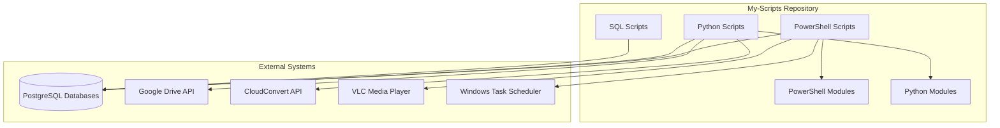
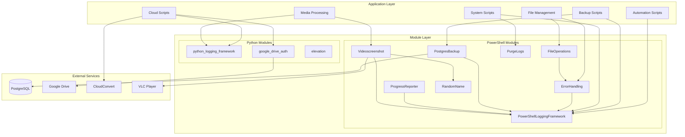

# My-Scripts Architecture

## Overview

This document describes the high-level architecture and design decisions for the My-Scripts repository. My-Scripts is a personal automation collection containing 79+ executable scripts across PowerShell, Python, SQL, Bash, and Batch languages. The repository provides reusable automation for database backups, file management, media processing, and cloud integrations.

**Version**: 2.0.0
**Primary Platform**: Windows (with partial Linux/macOS support via PowerShell Core)

## Design Principles

### 1. Language-Based Organization
Scripts are organized first by programming language (`src/powershell/`, `src/python/`, `src/sql/`), then by functional domain. This structure makes it easy to locate scripts and apply language-specific tooling.

### 2. Domain Categorization
Within each language directory, scripts are grouped by functional domain:
- **Backup**: Database backup automation (PostgreSQL, GnuCash, Timeline, JobScheduler)
- **Cloud**: Cloud service integrations (Google Drive, CloudConvert)
- **File Management**: File operations (copy, distribute, sync, restore)
- **Media**: Image/video processing (conversion, screenshots, duplicate detection)
- **System**: System maintenance (health checks, log cleanup, service management)
- **Automation**: Scheduled tasks and system automation

### 3. Shared Infrastructure
Reusable modules provide cross-cutting concerns:
- **PowerShell**: 8 shared modules (logging, error handling, file operations, PostgreSQL backup, etc.)
- **Python**: 3 shared modules (logging, Google Drive auth, elevation detection)
- **Unified Logging**: Cross-platform logging specification ensuring consistent log format across all languages

### 4. Cross-Platform Support
- **PowerShell Core 7+**: New scripts prefer PowerShell Core for cross-platform compatibility
- **Python 3.10+**: Python scripts designed for cross-platform execution
- **Platform-Specific Features**: Windows-specific features clearly documented (Task Scheduler, Windows services)

### 5. Test-Driven Quality
- **Unit Tests**: PowerShell (Pester) and Python (pytest) unit tests in `tests/` directory
- **Coverage Target**: Growing from baseline to 50%+ test coverage
- **CI/CD**: GitHub Actions for automated testing and quality checks

## System Context

My-Scripts is a personal automation collection that integrates with multiple external systems:



### Key External Integrations
- **PostgreSQL Databases**: GnuCash (personal finance), Timeline (location data), JobScheduler (task metadata)
- **Google Drive API**: Backup storage, file recovery, space monitoring (OAuth2 authentication)
- **CloudConvert API**: File format conversions
- **VLC Media Player**: Video frame capture and screenshot generation
- **Windows Task Scheduler**: Automated daily execution of backup and maintenance tasks

## Component Architecture

### High-Level Component Diagram



### Directory Structure

```
My-Scripts/
├── src/                          # Source code organized by language
│   ├── powershell/              # PowerShell scripts and modules
│   │   ├── automation/          # Automation utilities (scheduled tasks, PostgreSQL tests)
│   │   ├── backup/              # Database backup scripts
│   │   ├── cloud/               # Cloud integrations (CloudConvert)
│   │   ├── file-management/     # File operations (copy, distribute, sync, restore)
│   │   ├── git/                 # Git automation and hooks
│   │   ├── media/               # Image/video processing
│   │   ├── system/              # System maintenance
│   │   └── modules/             # Reusable PowerShell modules (8 modules)
│   ├── python/                  # Python scripts and modules
│   │   ├── cloud/               # Cloud services (Google Drive, CloudConvert)
│   │   ├── data/                # Data processing (CSV→GPX, timeline extraction)
│   │   ├── media/               # Media processing (duplicate detection, image recovery)
│   │   └── modules/             # Shared Python modules (3 modules)
│   ├── sql/                     # SQL DDL files
│   │   ├── timeline/            # Timeline database schemas (PostGIS enabled)
│   │   └── gnucash/             # GnuCash database utilities
│   ├── batch/                   # Windows batch scripts
│   └── sh/                      # Bash scripts
├── tests/                       # Unit and integration tests
│   ├── powershell/unit/         # PowerShell Pester tests
│   └── python/unit/             # Python pytest tests
├── config/                      # Configuration files
│   ├── modules/                 # Module deployment configuration
│   └── tasks/                   # Windows Task Scheduler definitions
├── docs/                        # Documentation
│   ├── architecture/            # Architecture documentation (this section)
│   ├── guides/                  # User guides and specifications
│   └── specifications/          # Technical specifications
├── scripts/                     # Repository management scripts
├── hooks/                       # Git hooks
├── analysis/                    # Code reviews and improvement tracking
└── logs/                        # Log files (auto-created)
```

## Key Design Decisions

### Decision 1: Monolithic Repository

**Context**: Multiple scripts across different languages and domains needed organization.

**Decision**: Keep as single repository (not split into separate repos per domain or language).

**Rationale**:
- Single maintainer (no team boundaries to manage)
- Shared infrastructure (logging, auth, database modules used across domains)
- Unified CI/CD pipeline for consistent quality checks
- Cross-script workflows (e.g., backup scripts using file management utilities)
- Simpler dependency management and versioning

**Alternatives Considered**:
- Separate repositories per domain (backup, media, cloud)
- Separate repositories per language (PowerShell-Scripts, Python-Scripts)

**Trade-offs**:
- ✅ **Pros**: Easier code reuse, simpler maintenance, unified versioning
- ⚠️ **Cons**: Repository may grow large over time, requires clear directory organization
- ⚠️ **Future Risk**: May need to split if repository exceeds manageable size or team grows

### Decision 2: Cross-Platform Logging Specification

**Context**: Scripts in PowerShell and Python needed consistent logging for troubleshooting and log aggregation.

**Decision**: Standardize log format across all languages with unified specification.

**Rationale**:
- **Easier Log Aggregation**: All logs follow same format, enabling centralized parsing
- **Consistent Troubleshooting**: Same fields available in every log (timestamp, level, hostname, PID)
- **Centralized Log Purging**: PurgeLogs module can clean up logs from any script
- **Cross-Platform Support**: Works on Windows and Linux with timezone awareness (IST)

**Implementation**: `docs/specifications/logging_specification.md`

**Log Format**:
```
[YYYY-MM-DD HH:mm:ss.fff TIMEZONE] [LEVEL] [ScriptName] [HostName] [PID] Message
```

**Alternatives Considered**:
- Using language-specific logging libraries without standardization
- Structured logging with JSON (implemented as optional format)

**Trade-offs**:
- ✅ **Pros**: Unified troubleshooting, easier log analysis
- ⚠️ **Cons**: Requires custom implementation in each language

### Decision 3: PowerShell 7+ for New Scripts

**Context**: Videoscreenshot module was migrated to PowerShell Core; needed to decide on standard for new scripts.

**Decision**: Prefer PowerShell 7+ (PowerShell Core) for new scripts with cross-platform intent.

**Rationale**:
- **Cross-Platform Support**: Runs on Windows, Linux, and macOS
- **Modern Language Features**: Better performance, improved cmdlets
- **Long-Term Viability**: PowerShell Core is the future of PowerShell

**Exceptions**:
- Windows-specific scripts (Task Scheduler, Windows services) may use Windows PowerShell 5.1
- Legacy scripts remain on Windows PowerShell until migration is needed

**Alternatives Considered**:
- Continue using Windows PowerShell 5.1 exclusively
- Migrate all scripts to Python for cross-platform support

**Trade-offs**:
- ✅ **Pros**: Future-proof, cross-platform, better performance
- ⚠️ **Cons**: Requires PowerShell Core installation, some Windows-specific cmdlets unavailable

### Decision 4: Module-Based Reusability

**Context**: Common functionality (logging, error handling, file operations) was duplicated across scripts.

**Decision**: Extract shared functionality into reusable modules deployed via automated deployment script.

**Rationale**:
- **DRY Principle**: Eliminates code duplication
- **Consistent Behavior**: Logging and error handling work the same across all scripts
- **Easier Maintenance**: Bug fixes and improvements apply to all consumers
- **Automated Deployment**: `deploy_modules.ps1` script handles installation to system or user module paths

**Implementation**:
- **PowerShell Modules**: 8 modules in `src/powershell/modules/`
- **Python Modules**: 3 modules in `src/python/modules/`
- **Deployment Configuration**: `config/modules/deployment.txt`

**Alternatives Considered**:
- Inline all common code (rejected due to duplication)
- Copy-paste shared functions (rejected due to maintenance burden)

**Trade-offs**:
- ✅ **Pros**: Reduced duplication, consistent behavior, easier testing
- ⚠️ **Cons**: Requires module deployment step, versioning complexity

### Decision 5: Retry Logic with Exponential Backoff

**Context**: File operations and network calls occasionally fail due to transient errors (file locks, network timeouts).

**Decision**: Implement standardized retry logic with exponential backoff in ErrorHandling and FileOperations modules.

**Rationale**:
- **Resilience**: Automatic recovery from transient failures
- **Predictable Behavior**: Consistent retry strategy across all scripts
- **Configurable**: Scripts can override retry count and delay

**Implementation**:
- **PowerShell**: `ErrorHandling` module with `Invoke-WithRetry` cmdlet
- **FileOperations**: `Copy-FileWithRetry`, `Move-FileWithRetry`, `Remove-FileWithRetry`
- **Default**: 3 retries with exponential backoff (1s, 2s, 4s)

**Alternatives Considered**:
- No retry logic (fail immediately)
- Fixed delay between retries

**Trade-offs**:
- ✅ **Pros**: More reliable operations, better user experience
- ⚠️ **Cons**: Longer execution time on persistent failures

### Decision 6: Unified Test Coverage Target (50%+)

**Context**: Repository had minimal test coverage initially.

**Decision**: Establish 50%+ test coverage target with incremental improvements.

**Rationale**:
- **Quality Assurance**: Catch regressions early
- **Refactoring Confidence**: Tests enable safe refactoring
- **Documentation**: Tests serve as usage examples
- **Incremental Approach**: Realistic target that improves over time

**Implementation**:
- **PowerShell**: Pester tests in `tests/powershell/unit/`
- **Python**: pytest tests in `tests/python/unit/`
- **CI/CD**: Automated test execution on every commit

**Current Status**: Growing from baseline to 50%+ coverage

**Alternatives Considered**:
- No testing (rejected due to quality risk)
- 100% coverage (rejected as unrealistic for personal scripts)

**Trade-offs**:
- ✅ **Pros**: Better quality, faster debugging, refactoring confidence
- ⚠️ **Cons**: Additional development time, test maintenance

## Architecture Documentation

For detailed architecture information, see:

- **[Database Schemas](docs/architecture/database-schemas.md)** – PostgreSQL database schemas with ER diagrams
- **[Module Dependencies](docs/architecture/module-dependencies.md)** – Module dependency graphs and relationships
- **[External Integrations](docs/architecture/external-integrations.md)** – External service integrations (Google Drive, CloudConvert, PostgreSQL, VLC)
- **[Data Flows](docs/architecture/data-flows.md)** – Data flow diagrams for key workflows

## Version History

- **2.0.0** (Current): Major refactoring with module extraction, test framework, unified logging
- **1.x**: Initial script collection

## License

This is a personal script collection. See repository root for license information.
