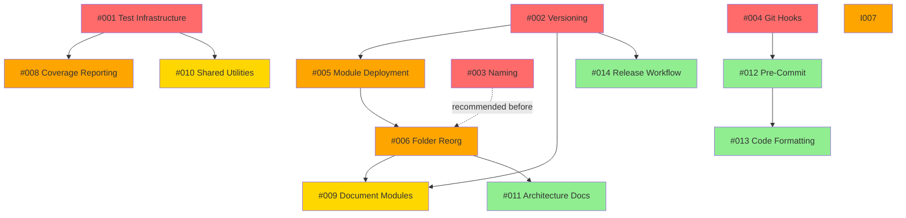

# My-Scripts Repository Improvement Issues

This directory contains **14 actionable GitHub issue drafts** generated from the comprehensive repository review (see `../my-scripts-claude-review.md`).

## Issue Index

### Critical Priority (Immediate Attention) 🔴

| # | Issue | Description | Est. Effort |
|---|-------|-------------|-------------|
| [001](001-implement-test-infrastructure.md) | **Implement Test Infrastructure** | Create comprehensive test infrastructure (pytest, Pester) with minimum 30% coverage for shared modules | 2-3 days |
| [002](002-create-root-changelog-and-versioning.md) | **Create Root CHANGELOG and Versioning** | Establish repository-level semantic versioning, create CHANGELOG.md, document version history | 1-2 days |
| [003](003-standardize-naming-conventions.md) | **Standardize Naming Conventions** | Standardize PowerShell to Verb-Noun (PascalCase), Python to snake_case across all scripts | 2-3 days |
| [004](004-activate-git-hooks.md) | **Activate Git Hooks** | Activate existing git hook scripts, create pre-commit/commit-msg hooks for quality enforcement | 2 days |

### High Priority (Short-term) 🟠

| # | Issue | Description | Est. Effort |
|---|-------|-------------|-------------|
| [005](005-complete-module-deployment-config.md) | **Complete Module Deployment Config** | Configure all PowerShell/Python modules for automated deployment to PSModulePath/site-packages | 2 days |
| [006](006-reorganize-folder-structure.md) | **Reorganize Folder Structure** | Reorganize scripts by domain (backup, git, media, etc.) while preserving git history | 3-4 days |
| [007](007-create-installation-guide.md) | **Create Installation Guide** | Create comprehensive INSTALLATION.md with platform-specific setup instructions | 1-2 days |
| [008](008-add-test-coverage-reporting.md) | **Add Test Coverage Reporting** | Enable pytest-cov/Pester coverage reporting, integrate with Codecov and SonarCloud | 1-2 days |

### Moderate Priority (Medium-term) 🟡

| # | Issue | Description | Est. Effort |
|---|-------|-------------|-------------|
| [009](009-document-missing-modules.md) | **Document Missing Modules** | Create comprehensive README.md and CHANGELOG.md for RandomName, PostgresBackup, Logging modules | 2-3 days |
| [010](010-extract-shared-utilities.md) | **Extract Shared Utilities** | Extract common patterns (error handling, file operations) into reusable modules | 3-4 days |

### Low Priority (Long-term) 🟢

| # | Issue | Description | Est. Effort |
|---|-------|-------------|-------------|
| [011](011-create-architecture-documentation.md) | **Create Architecture Documentation** | Document database schemas, module dependencies, external integrations, design decisions | 2-3 days |
| [012](012-implement-pre-commit-framework.md) | **Implement Pre-Commit Framework** | Replace manual git hooks with pre-commit framework for multi-language linting | 1-2 days |
| [013](013-add-code-formatting-automation.md) | **Add Code Formatting Automation** | Implement Black (Python), PSScriptAnalyzer (PowerShell), SQLFluff (SQL) formatters | 1 day |
| [014](014-create-automated-release-workflow.md) | **Create Automated Release Workflow** | Implement GitHub Actions workflow for semantic versioning, release notes, module publishing | 1-2 days |

## Priority Summary

- **Critical (🔴):** 4 issues – 7-10 days total
- **High (🟠):** 4 issues – 9-12 days total
- **Moderate (🟡):** 2 issues – 5-7 days total
- **Low (🟢):** 4 issues – 6-9 days total

**Total Estimated Effort:** 27-38 days (~5-8 weeks)

## Recommended Implementation Order

### Phase 1: Foundation (Weeks 1-2)
1. **Issue #001** – Implement Test Infrastructure
2. **Issue #002** – Create Root CHANGELOG and Versioning
3. **Issue #004** – Activate Git Hooks
4. **Issue #008** – Add Test Coverage Reporting

**Outcome:** Testing infrastructure operational, version tracking established, quality gates enforced

### Phase 2: Standardization (Weeks 3-4)
1. **Issue #003** – Standardize Naming Conventions
2. **Issue #007** – Create Installation Guide
3. **Issue #005** – Complete Module Deployment Config
4. **Issue #012** – Implement Pre-Commit Framework

**Outcome:** Consistent naming, automated deployment, installation documented, linting enforced

### Phase 3: Organization (Weeks 5-6)
1. **Issue #006** – Reorganize Folder Structure
2. **Issue #009** – Document Missing Modules
3. **Issue #010** – Extract Shared Utilities

**Outcome:** Logical folder structure, all modules documented, code duplication reduced

### Phase 4: Polish (Weeks 7-8)
1. **Issue #011** – Create Architecture Documentation
2. **Issue #013** – Add Code Formatting Automation
3. **Issue #014** – Create Automated Release Workflow

**Outcome:** Professional documentation, automated formatting, streamlined releases

## Dependencies



## Usage

### Creating GitHub Issues

To create these issues in GitHub, use the provided script:

```bash
# Using the create_github_issues.sh script
cd analysis/my-scripts-issues
../../src/sh/create_github_issues.sh .

# Or manually create via GitHub CLI
for file in *.md; do
  if [ "$file" != "README.md" ]; then
    gh issue create --title "$(head -1 $file | sed 's/# //')" --body-file "$file"
  fi
done
```

### Tracking Progress

You can track implementation progress by:
1. Creating a GitHub Project board
2. Adding all issues to the board
3. Organizing by priority and phase
4. Moving cards as work progresses

## Review Context

These issues were generated from:
- **Review Date:** 2025-11-16
- **Reviewer:** Claude.ai / code (Sonnet 4.5)
- **Review Document:** `analysis/my-scripts-claude-review.md`
- **Repository State:** commit c7c513f + local modifications

## Key Findings

**Repository Verdict:** ✅ **REMAIN MONOLITHIC**

**Coherence Score:** 7/10

**Major Recommendations:**
1. Focus on standardization over fragmentation
2. Implement testing infrastructure (highest priority)
3. Improve documentation consistency
4. Extract common utilities to reduce duplication
5. Maintain shared infrastructure benefits

## Additional Resources

- [Main Review Document](../my-scripts-claude-review.md) – Comprehensive analysis
- [Logging Specification](../../docs/logging_specification.md) – Existing spec
- [Videoscreenshot CHANGELOG](../../src/powershell/module/Videoscreenshot/CHANGELOG.md) – Template for module changelogs
- [SonarCloud Dashboard](https://sonarcloud.io/dashboard?id=manoj-bhaskaran_My-Scripts) – Code quality metrics

## Questions or Feedback

For questions about these issues or the review process, please:
1. Open a discussion in the repository
2. Reference the review document (`my-scripts-claude-review.md`)
3. Tag issues with appropriate labels (e.g., `enhancement`, `documentation`, `testing`)

---

**Generated:** 2025-11-16 by Claude.ai / code
**Repository:** manoj-bhaskaran/My-Scripts
**Branch:** claude/review-my-scripts-repo-0114Pmrsis8Z6zF9QgPPDWok
