# Data Flows

## Overview

This document describes the key data flows and workflows in the My-Scripts repository. Understanding these flows is essential for:
- **Troubleshooting**: Identifying where failures occur in multi-step processes
- **Optimization**: Finding bottlenecks and opportunities for parallelization
- **Maintenance**: Understanding the impact of changes to components
- **Onboarding**: Learning how different parts of the system interact

---

## Workflow Summary

| Workflow | Trigger | Duration | Critical Path |
|----------|---------|----------|---------------|
| **Database Backup** | Daily 2:00 AM | 5-15 min | PostgreSQL → Local → Google Drive |
| **Timeline Processing** | Manual | 10-30 min | JSON/CSV → PostgreSQL → GPX |
| **Log Management** | Weekly | 1-5 min | Log Discovery → Age Check → Delete |
| **File Distribution** | Manual | Variable | Source → Random Name → Destination |
| **Video Screenshot** | Manual | <1 min | Video → VLC → PNG → Optional Crop |
| **Git Commit** | On commit | <1 min | pre-commit → commit → post-commit |

---

## 1. Database Backup Workflow

### Overview

Daily automated backup of PostgreSQL databases (GnuCash, Timeline, Job Scheduler) with local retention and Google Drive upload for off-site storage.

### Sequence Diagram

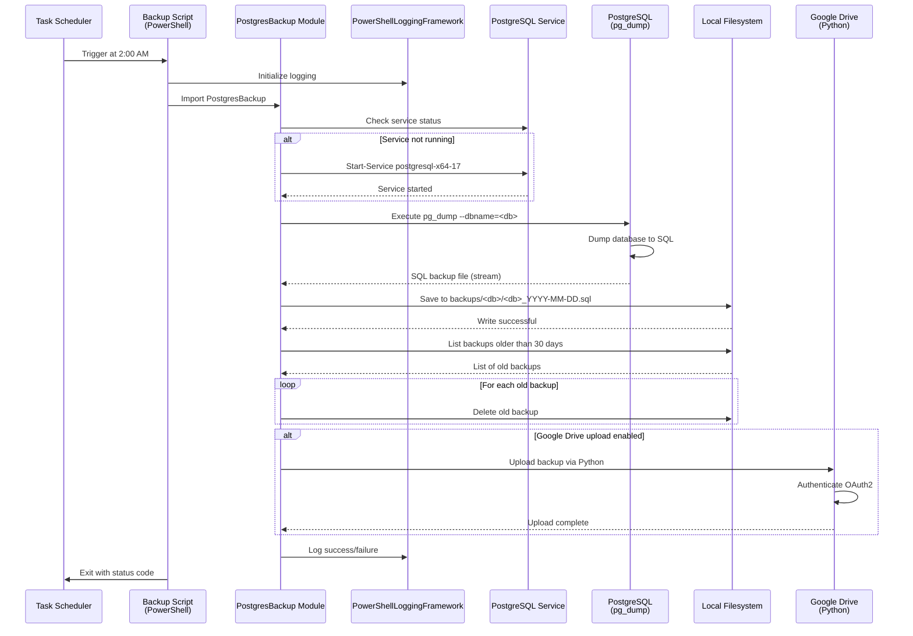

### Data Flow Diagram

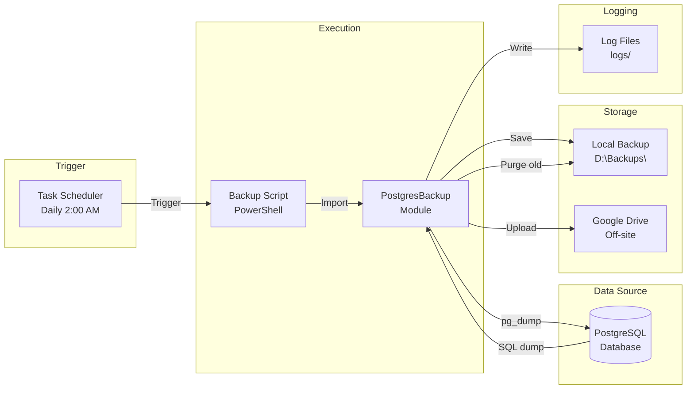

### Steps

1. **Trigger**: Task Scheduler executes backup script at 2:00 AM
2. **Initialize**: Script imports PostgresBackup module and initializes logging
3. **Service Check**: Module checks if PostgreSQL service is running, starts if needed
4. **Dump Database**: Module executes `pg_dump` to create SQL backup
5. **Save Locally**: Backup saved to `backups/<database>/<database>_YYYY-MM-DD.sql`
6. **Purge Old**: Backups older than 30 days are deleted from local storage
7. **Upload**: (Optional) Backup uploaded to Google Drive via Python helper
8. **Log**: Success/failure logged to `logs/Backup-<Database>_powershell_YYYY-MM-DD.log`
9. **Exit**: Script exits with status code (0 = success, 1 = failure)

### Critical Path

**Total Time**: 5-15 minutes (depending on database size)

- **pg_dump execution**: 3-10 minutes (database size dependent)
- **Local save**: <1 minute (I/O dependent)
- **Google Drive upload**: 1-5 minutes (network dependent)
- **Old backup purge**: <1 minute

### Error Handling

**Retry Logic**:
- File operations: 3 retries with exponential backoff (ErrorHandling module)
- PostgreSQL connection: No retry (fail immediately)
- Google Drive upload: 3 retries with exponential backoff

**Failure Scenarios**:
1. **PostgreSQL service not running**: Module attempts to start service
2. **pg_dump fails**: Script logs error and exits with code 1
3. **Disk full**: Script logs error, may fail to save backup
4. **Google Drive upload fails**: Script logs warning, continues (local backup succeeded)

### Configuration

**Script Parameters**:
- `DatabaseName`: Database to backup
- `BackupPath`: Local backup directory
- `RetentionDays`: Days to retain backups (default: 30)
- `UploadToGoogleDrive`: Enable Google Drive upload (default: false)

**Example**:
```powershell
.\Backup-GnuCashDatabase.ps1 -DatabaseName "gnucash" -BackupPath "D:\Backups\gnucash" -RetentionDays 30 -UploadToGoogleDrive
```

---

## 2. Timeline Processing Workflow

### Overview

Process Google Timeline exports (JSON or CSV) to extract location data, load into PostgreSQL database, and optionally export to GPX format with elevation data.

### Sequence Diagram

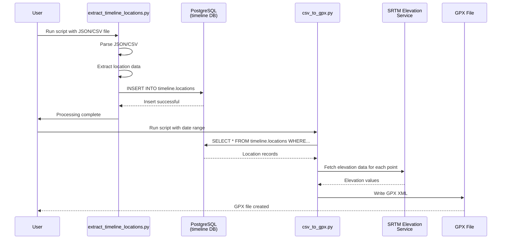

### Data Flow Diagram

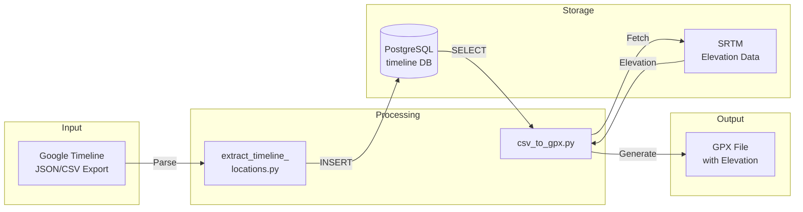

### Steps

**Phase 1: Extract and Load**
1. **Input**: User provides Google Timeline export (JSON or CSV)
2. **Parse**: `extract_timeline_locations.py` parses file
3. **Extract**: Script extracts timestamp, latitude, longitude, elevation, accuracy
4. **Transform**: Convert timestamps to UTC, validate coordinates
5. **Load**: INSERT records into `timeline.locations` table
6. **Index**: PostgreSQL automatically updates spatial indexes

**Phase 2: Export to GPX**
7. **Query**: `csv_to_gpx.py` queries database for date range
8. **Elevation**: For each point, fetch elevation from SRTM service (if missing)
9. **Generate**: Create GPX XML with trackpoints
10. **Output**: Save GPX file to disk

### Critical Path

**Phase 1 (Extract and Load)**: 10-20 minutes (10,000 records)
- Parse JSON/CSV: 2-5 minutes
- Database inserts: 5-10 minutes (with indexes)
- Validation: 1-2 minutes

**Phase 2 (Export to GPX)**: 5-15 minutes (1,000 points)
- Database query: <1 minute
- SRTM elevation fetch: 3-10 minutes (network dependent)
- GPX generation: 1-2 minutes

### Data Format

**Input (JSON)**:
```json
{
  "locations": [
    {
      "timestampMs": "1640000000000",
      "latitudeE7": 404567890,
      "longitudeE7": -740123456,
      "accuracy": 20,
      "altitude": 100
    }
  ]
}
```

**Database (timeline.locations)**:
```sql
timestamp              | latitude  | longitude  | elevation | accuracy
-----------------------+-----------+------------+-----------+---------
2025-01-01 12:00:00+00 | 40.456789 | -74.012346 | 100.0     | 20
```

**Output (GPX)**:
```xml
<gpx version="1.1">
  <trk>
    <trkseg>
      <trkpt lat="40.456789" lon="-74.012346">
        <ele>100.0</ele>
        <time>2025-01-01T12:00:00Z</time>
      </trkpt>
    </trkseg>
  </trk>
</gpx>
```

---

## 3. Log Management Workflow

### Overview

Weekly automated cleanup of old log files across all scripts to prevent disk space exhaustion.

### Sequence Diagram

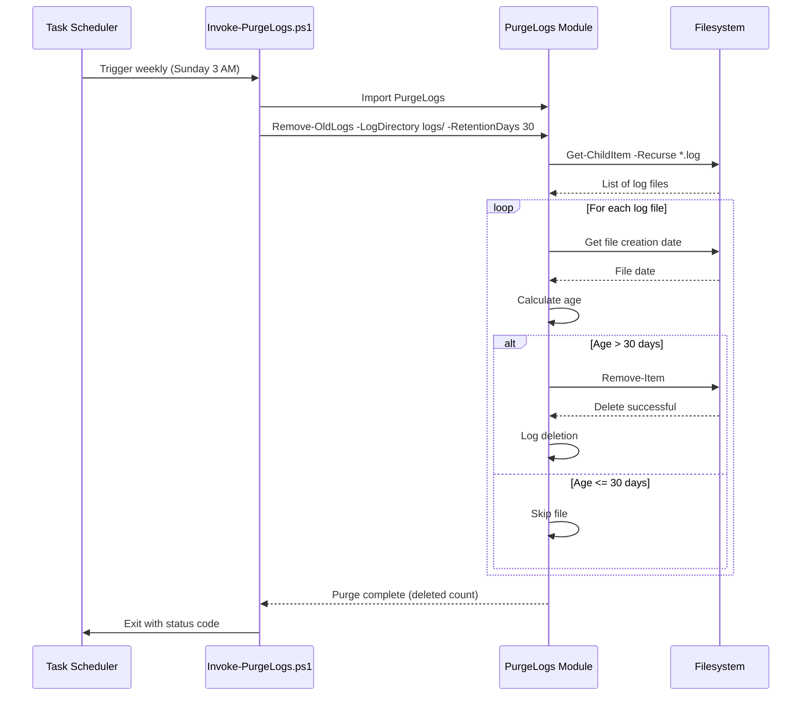

### Data Flow Diagram

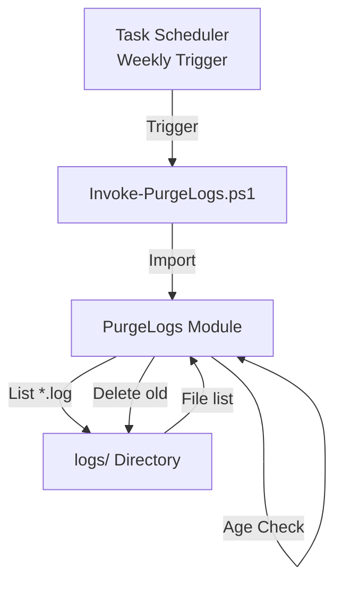

### Steps

1. **Trigger**: Task Scheduler executes script weekly (Sunday 3:00 AM)
2. **Import**: Script imports PurgeLogs module
3. **Discovery**: Module recursively lists all `.log` files in `logs/` directory
4. **Age Check**: For each file, calculate age (current date - file creation date)
5. **Delete**: If age > retention period (default: 30 days), delete file
6. **Log**: Log deletion count and any errors
7. **Exit**: Script exits with status code

### Configuration

**Parameters**:
- `LogDirectory`: Directory to search for logs (default: `logs/`)
- `RetentionDays`: Days to retain logs (default: 30)
- `Recurse`: Search subdirectories (default: true)
- `WhatIf`: Dry run mode (default: false)

**Example**:
```powershell
Remove-OldLogs -LogDirectory "C:\Scripts\logs" -RetentionDays 30 -Recurse -WhatIf
```

### Log File Naming Convention

**Format**: `<ScriptName>_<Language>_YYYY-MM-DD.log`

**Examples**:
- `Backup-GnuCashDatabase_powershell_2025-11-21.log`
- `gdrive_recover_python_2025-11-21.log`
- `extract_timeline_locations_python_2025-11-21.log`

---

## 4. File Distribution Workflow

### Overview

Distribute files from source to multiple destinations with random filename generation and optional deduplication.

### Sequence Diagram

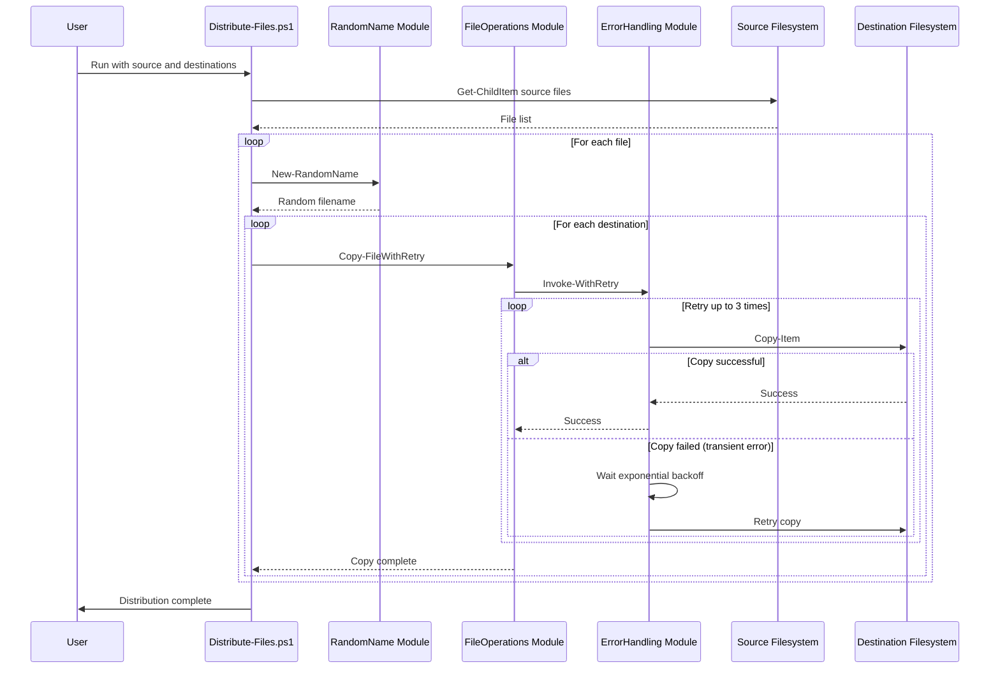

### Data Flow Diagram

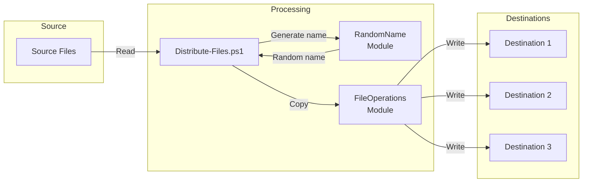

### Steps

1. **Input**: User provides source directory and destination directories
2. **Discovery**: Script lists all files in source directory
3. **Loop**: For each file:
   - Generate random filename using RandomName module
   - For each destination:
     - Copy file using FileOperations module (with retry)
     - Log success/failure
4. **Output**: Files distributed to all destinations with random names

### Error Handling

**Retry Logic** (FileOperations → ErrorHandling):
- **Retries**: 3 attempts
- **Backoff**: Exponential (1s, 2s, 4s)
- **Transient Errors**: File locked, network timeout
- **Permanent Errors**: Disk full, permission denied (no retry)

---

## 5. Video Screenshot Workflow

### Overview

Capture video frames at specific timestamps using VLC, with optional Python-based cropping to remove black bars.

### Sequence Diagram

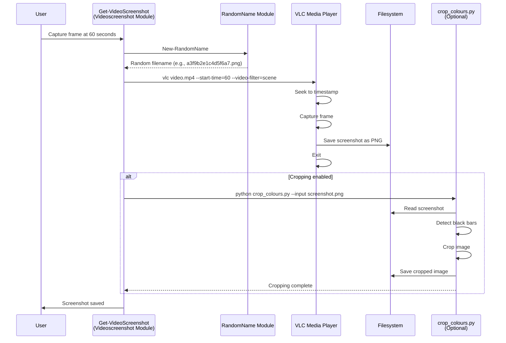

### Data Flow Diagram

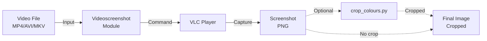

### Steps

1. **Input**: User specifies video file and timestamp
2. **Generate Name**: RandomName module generates output filename
3. **VLC Command**: Module constructs VLC command:
   ```powershell
   vlc "video.mp4" --rate=1 --video-filter=scene --start-time=60 --stop-time=61 --scene-format=png --scene-path="output/" --scene-prefix="a3f9b2e1c4d5f6a7_" vlc://quit
   ```
4. **Capture**: VLC seeks to timestamp, captures frame, saves PNG, exits
5. **Crop** (Optional): Python script detects and removes black bars
6. **Output**: Screenshot saved to specified directory

### Alternative Methods

**GDI+ (Windows Only)**:
```powershell
Get-VideoScreenshotGDI -VideoPath "video.mp4" -Timestamp 60
```
- Uses Windows GDI+ library
- No external dependencies
- Faster than VLC for single frames

---

## 6. Git Commit Workflow

### Overview

Automated quality checks and module deployment on Git commits, enforcing coding standards and ensuring modules are deployed before commit.

### Sequence Diagram

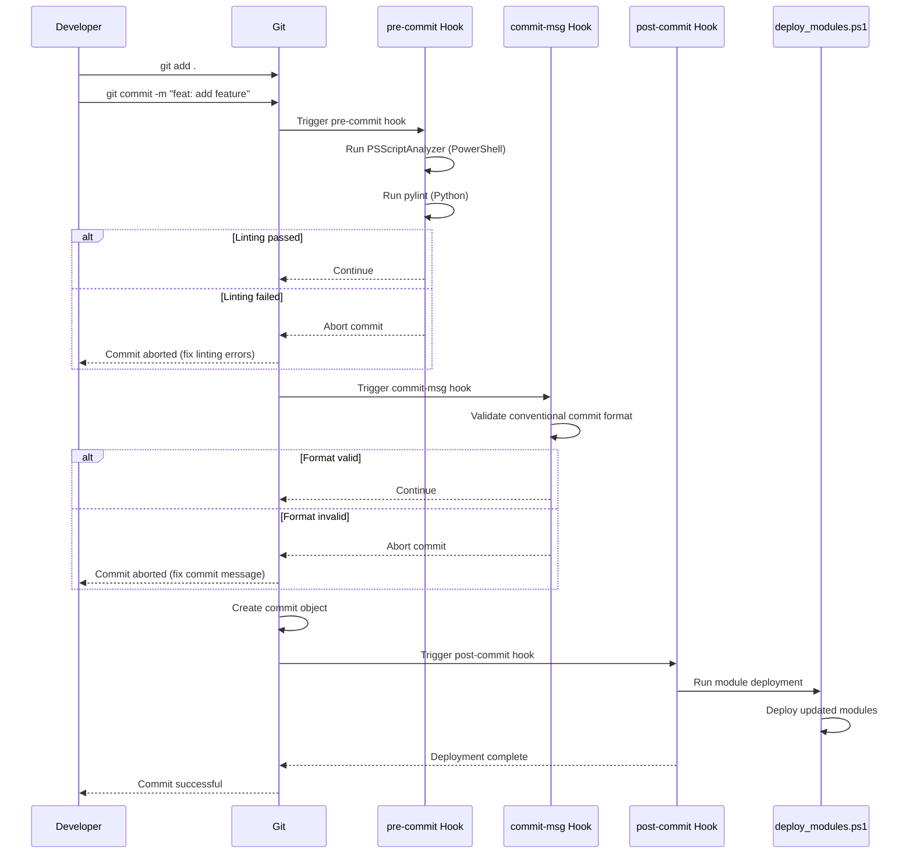

### Data Flow Diagram

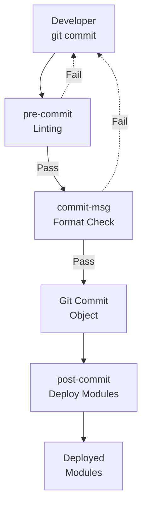

### Steps

**Pre-Commit**:
1. **Trigger**: `git commit` invokes `hooks/pre-commit`
2. **PSScriptAnalyzer**: Lint PowerShell files (`.ps1`, `.psm1`)
3. **pylint**: Lint Python files (`.py`)
4. **Result**: Abort commit if linting fails

**Commit-Msg**:
5. **Trigger**: Commit message validation
6. **Regex Check**: Validate conventional commit format
7. **Result**: Abort commit if format invalid

**Post-Commit**:
8. **Trigger**: After commit is created
9. **Deploy**: Run `scripts/deploy_modules.ps1` to deploy updated modules
10. **Log**: Log deployment results

### Conventional Commit Format

**Pattern**: `^(feat|fix|docs|style|refactor|test|chore)(\(.+\))?: .+$`

**Valid Examples**:
- `feat: add Google Drive upload to backups`
- `fix(logging): correct timestamp timezone handling`
- `docs(architecture): add data flow diagrams`

**Invalid Examples**:
- `Added new feature` (no type)
- `feat add feature` (missing colon)
- `FEAT: add feature` (uppercase type)

---

## 7. Module Deployment Workflow

### Overview

Deploy PowerShell modules to system or user module directories based on configuration file.

### Sequence Diagram

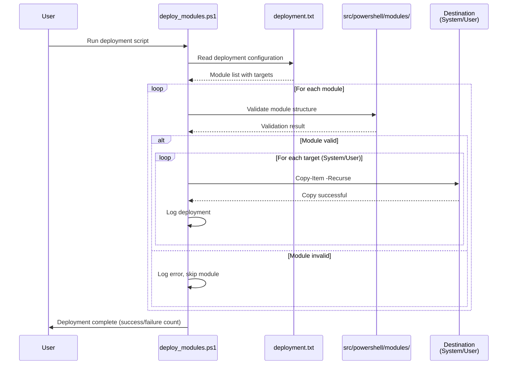

### Configuration Format

**File**: `config/modules/deployment.txt`

**Format**:
```
ModuleName | RelativePath | Targets | Author | Description
PowerShellLoggingFramework | src/powershell/modules/PowerShellLoggingFramework | System,User | Manoj | Logging framework
ErrorHandling | src/powershell/modules/ErrorHandling | User | Manoj | Error handling with retry
```

**Targets**:
- `System`: `C:\Program Files\PowerShell\Modules\` (requires admin)
- `User`: `~\Documents\PowerShell\Modules\`
- `Alt`: Custom path (specified in config)

---

## Performance Considerations

### Parallelization Opportunities

1. **Database Backups**: Run GnuCash, Timeline, and JobScheduler backups in parallel
2. **File Distribution**: Copy to multiple destinations in parallel
3. **Timeline Processing**: Batch insert multiple records per transaction
4. **Log Purge**: Process multiple directories in parallel

### Bottlenecks

1. **PostgreSQL Backup**: Large databases (>1GB) take 10+ minutes to dump
2. **Google Drive Upload**: Network-dependent, can timeout on slow connections
3. **SRTM Elevation Fetch**: Sequential API calls (no batch endpoint)
4. **VLC Screenshot**: VLC startup overhead (~1-2 seconds per screenshot)

### Optimization Strategies

1. **Database Backups**: Use `pg_dump --format=custom` for compression
2. **Google Drive**: Implement chunked uploads with resume capability
3. **SRTM**: Cache elevation data locally to reduce API calls
4. **VLC**: Use GDI+ method for single screenshots (faster)

---

## Related Documentation

- **[Database Schemas](database-schemas.md)** – Database structure details
- **[Module Dependencies](module-dependencies.md)** – Module relationships
- **[External Integrations](external-integrations.md)** – External service details
- **[ARCHITECTURE.md](../../ARCHITECTURE.md)** – High-level architecture overview

---

## Maintenance

**Keeping This Document Updated**:
1. Add new workflows when significant processes are automated
2. Update sequence diagrams when process steps change
3. Document new bottlenecks and optimization strategies
4. Review workflows quarterly for accuracy
