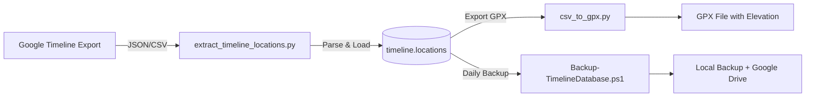
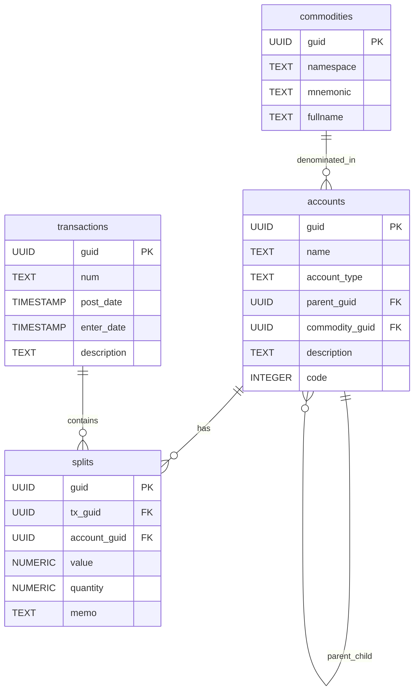
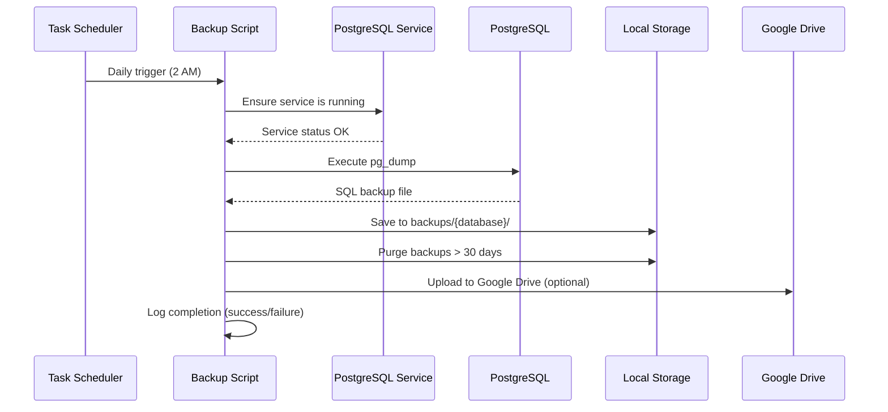

# Database Schemas

## Overview

My-Scripts interacts with multiple PostgreSQL databases for personal data management and backup. All databases use PostgreSQL 17+ and are backed up daily via automated scripts. Backups are retained for 30 days locally and uploaded to Google Drive for off-site storage.

## Database Summary

| Database | Purpose | Backup Script | Schema Location | PostGIS |
|----------|---------|---------------|-----------------|---------|
| **timeline** | Personal location/timeline data storage | `Backup-TimelineDatabase.ps1` | `src/sql/timeline/` | Yes |
| **gnucash** | Personal finance tracking | `Backup-GnuCashDatabase.ps1` | External (GnuCash app) | No |
| **jobscheduler** | Task scheduling metadata | `Backup-JobSchedulerDatabase.ps1` | External | No |

---

## Timeline Database

### Purpose
Stores personal location and timeline data with spatial indexing for efficient geospatial queries. Enables tracking of location history, activity patterns, and geographic analysis.

### Backup Strategy
- **Script**: `src/powershell/backup/Backup-TimelineDatabase.ps1`
- **Schedule**: Daily automated backups via Windows Task Scheduler
- **Retention**: 30 days local + Google Drive upload
- **Format**: PostgreSQL dump file (`.sql`)

### Database Configuration
- **PostgreSQL Version**: 17+
- **Extensions**: PostGIS (spatial data support)
- **Schema**: `timeline`
- **Location**: `D:\Program Files\PostgreSQL\17\`
- **Service**: `postgresql-x64-17`

### Schema Design

#### ER Diagram

```mermaid
erDiagram
    timeline_locations {
        BIGSERIAL location_id PK
        TIMESTAMP_WITH_TIME_ZONE timestamp NOT_NULL
        DOUBLE_PRECISION latitude NOT_NULL
        DOUBLE_PRECISION longitude NOT_NULL
        DOUBLE_PRECISION elevation NULL
        INTEGER accuracy NULL
        TEXT activity_type NULL
        INTEGER confidence NULL
        GEOMETRY location "Point, 4326"
    }
```

#### Table: `timeline.locations`

**Purpose**: Stores individual location data points with timestamps and spatial coordinates.

**Columns**:

| Column | Type | Constraints | Description |
|--------|------|-------------|-------------|
| `location_id` | BIGSERIAL | PRIMARY KEY | Auto-incrementing unique identifier |
| `timestamp` | TIMESTAMP WITH TIME ZONE | NOT NULL | Timestamp of location entry (timezone-aware) |
| `latitude` | DOUBLE PRECISION | NOT NULL | Latitude coordinate (decimal degrees) |
| `longitude` | DOUBLE PRECISION | NOT NULL | Longitude coordinate (decimal degrees) |
| `elevation` | DOUBLE PRECISION | NULL | Elevation in meters (optional) |
| `accuracy` | INTEGER | NULL | Accuracy of location measurement (optional) |
| `activity_type` | TEXT | NULL | Type of activity at this location (optional) |
| `confidence` | INTEGER | NULL | Confidence level of activity type (optional) |
| `location` | GEOMETRY(Point, 4326) | NULL | PostGIS spatial point (SRID 4326 = WGS84) |

**Indexes**:

```sql
-- Efficient time-based queries
CREATE INDEX idx_locations_timestamp ON timeline.locations (timestamp);

-- Efficient spatial queries (PostGIS GIST index)
CREATE INDEX idx_locations_location ON timeline.locations USING GIST (location);

-- Efficient geospatial queries on latitude/longitude
CREATE INDEX idx_locations_latitude_longitude
ON timeline.locations (latitude, longitude);

-- Partial index for locations with elevation data
CREATE INDEX idx_locations_elevation_not_null
ON timeline.locations (elevation)
WHERE elevation IS NOT NULL;
```

**Key Design Decisions**:
- **PostGIS Integration**: Uses PostGIS `GEOMETRY` type for spatial indexing and efficient geospatial queries
- **Timezone Awareness**: `TIMESTAMP WITH TIME ZONE` ensures correct handling of timestamps across timezones
- **Partial Indexing**: Elevation index only covers non-NULL values to reduce index size
- **Composite Indexing**: Separate indexes for time-based and spatial queries optimize different query patterns

### Data Flow



### Processing Scripts

| Script | Language | Purpose |
|--------|----------|---------|
| `extract_timeline_locations.py` | Python | Parse Google Timeline exports and load into database |
| `csv_to_gpx.py` | Python | Export location data to GPX format with SRTM elevation data |
| `Backup-TimelineDatabase.ps1` | PowerShell | Daily automated backup to local storage and Google Drive |

### Access Patterns

**Common Queries**:
1. **Time-based queries**: Retrieve locations within a date range
   ```sql
   SELECT * FROM timeline.locations
   WHERE timestamp BETWEEN '2024-01-01' AND '2024-12-31';
   ```

2. **Spatial queries**: Find locations within a geographic region
   ```sql
   SELECT * FROM timeline.locations
   WHERE ST_DWithin(location::geography, ST_MakePoint(-73.935242, 40.730610)::geography, 1000);
   ```

3. **Elevation queries**: Find locations with elevation data
   ```sql
   SELECT * FROM timeline.locations
   WHERE elevation IS NOT NULL
   ORDER BY elevation DESC;
   ```

### Users and Permissions

```sql
-- Timeline writer user (for data loading scripts)
CREATE USER timeline_writer WITH PASSWORD '***';
GRANT USAGE ON SCHEMA timeline TO timeline_writer;
GRANT INSERT, SELECT ON timeline.locations TO timeline_writer;
GRANT USAGE, SELECT ON SEQUENCE timeline.locations_location_id_seq TO timeline_writer;

-- Backup user (for pg_dump operations)
CREATE USER backup WITH PASSWORD '***';
GRANT USAGE ON SCHEMA timeline TO backup;
GRANT SELECT ON ALL TABLES IN SCHEMA timeline TO backup;
```

**Script Location**: `src/sql/timeline/user_timeline_writer.sql`, `src/sql/timeline/user_backup.sql`

---

## GnuCash Database

### Purpose
Personal finance tracking and accounting. GnuCash is an open-source personal finance application that uses PostgreSQL as a backend database.

### Backup Strategy
- **Script**: `src/powershell/backup/Backup-GnuCashDatabase.ps1`
- **Schedule**: Daily automated backups via Windows Task Scheduler
- **Retention**: 30 days local + Google Drive upload
- **Format**: PostgreSQL dump file (`.sql`)

### Schema Overview

GnuCash uses a complex schema with multiple tables for double-entry bookkeeping:



**Key Tables**:
- **`accounts`**: Chart of accounts (assets, liabilities, income, expenses)
- **`transactions`**: Financial transactions (date, description)
- **`splits`**: Transaction lines (double-entry bookkeeping)
- **`commodities`**: Currencies and securities (USD, EUR, stocks)

**Relationships**:
- Each transaction has multiple splits (minimum 2 for double-entry)
- Each split links to an account
- Accounts are hierarchical (parent-child relationships)
- Accounts are denominated in a commodity (currency)

### Utility Scripts

| Script | Language | Purpose |
|--------|----------|---------|
| `gnucash_hide_zero_balance_accts.sql` | SQL | Hide accounts with zero balance for cleaner reports |
| `gnucash_unhide_zero_balance_accts.sql` | SQL | Unhide zero-balance accounts |
| `Backup-GnuCashDatabase.ps1` | PowerShell | Daily automated backup |

### Access Patterns

**Common Queries**:
1. **Account hierarchy**: Retrieve full account tree
2. **Transaction history**: Get all transactions for an account
3. **Balance calculation**: Sum splits by account

---

## Job Scheduler Database

### Purpose
Stores metadata for scheduled tasks and job execution history. Used for tracking automated job execution, success/failure status, and scheduling metadata.

### Backup Strategy
- **Script**: `src/powershell/backup/Backup-JobSchedulerDatabase.ps1`
- **Schedule**: Daily automated backups via Windows Task Scheduler
- **Retention**: 30 days local + Google Drive upload
- **Format**: PostgreSQL dump file (`.sql`)

### Schema Overview

**Note**: Schema is managed externally (not in repository). Likely contains tables for:
- Job definitions (name, schedule, command)
- Execution history (start time, end time, status, output)
- Job dependencies (job execution order)

### Access Patterns

**Common Operations**:
1. **Job execution logging**: Record job start/end times and status
2. **History queries**: Retrieve execution history for a job
3. **Scheduling queries**: Determine next job execution time

---

## Database Backup Architecture

### Common Backup Infrastructure

All database backups use the **PostgresBackup** PowerShell module (`src/powershell/modules/PostgresBackup/`), which provides:

- **Automated `pg_dump`**: Uses PostgreSQL client tools
- **Service Management**: Starts/stops PostgreSQL service if needed
- **Retention Management**: Deletes backups older than 30 days
- **Google Drive Upload**: Optional upload to Google Drive for off-site storage
- **Logging**: Standardized logging using PowerShellLoggingFramework

### Backup Workflow



### Backup File Naming Convention

```
{database}_{YYYY-MM-DD}.sql
```

**Examples**:
- `timeline_2025-11-21.sql`
- `gnucash_2025-11-21.sql`
- `jobscheduler_2025-11-21.sql`

### Backup Configuration

**PostgreSQL Connection**:
- **Authentication**: `.pgpass` file (Windows: `%APPDATA%\postgresql\pgpass.conf`)
- **Format**: `hostname:port:database:username:password`
- **Environment Variables**: `PGHOST`, `PGPORT`, `PGUSER`, `PGPASSWORD` (alternative)

**Backup Location**:
- **Local**: Configurable (default: `D:\Backups\{database}/`)
- **Google Drive**: Uploaded via `google_drive_auth.py` module

---

## Database Design Patterns

### 1. Timezone Awareness
All timestamps use `TIMESTAMP WITH TIME ZONE` to ensure correct handling across timezones.

### 2. Spatial Indexing
Timeline database uses PostGIS for efficient geospatial queries with GIST indexes.

### 3. Partial Indexing
Indexes only cover relevant rows (e.g., elevation index only for non-NULL values) to reduce index size.

### 4. UUID Primary Keys
GnuCash uses UUIDs for distributed data consistency and avoiding ID collisions.

### 5. Composite Indexes
Multiple indexes optimize different query patterns (time-based vs. spatial queries).

---

## Related Documentation

- **[External Integrations](external-integrations.md)** – PostgreSQL connection and authentication
- **[Data Flows](data-flows.md)** – Database backup workflow diagrams
- **[Module Dependencies](module-dependencies.md)** – PostgresBackup module dependencies

---

## References

- **PostgreSQL Documentation**: https://www.postgresql.org/docs/
- **PostGIS Documentation**: https://postgis.net/documentation/
- **GnuCash Database Schema**: https://wiki.gnucash.org/wiki/SQL
