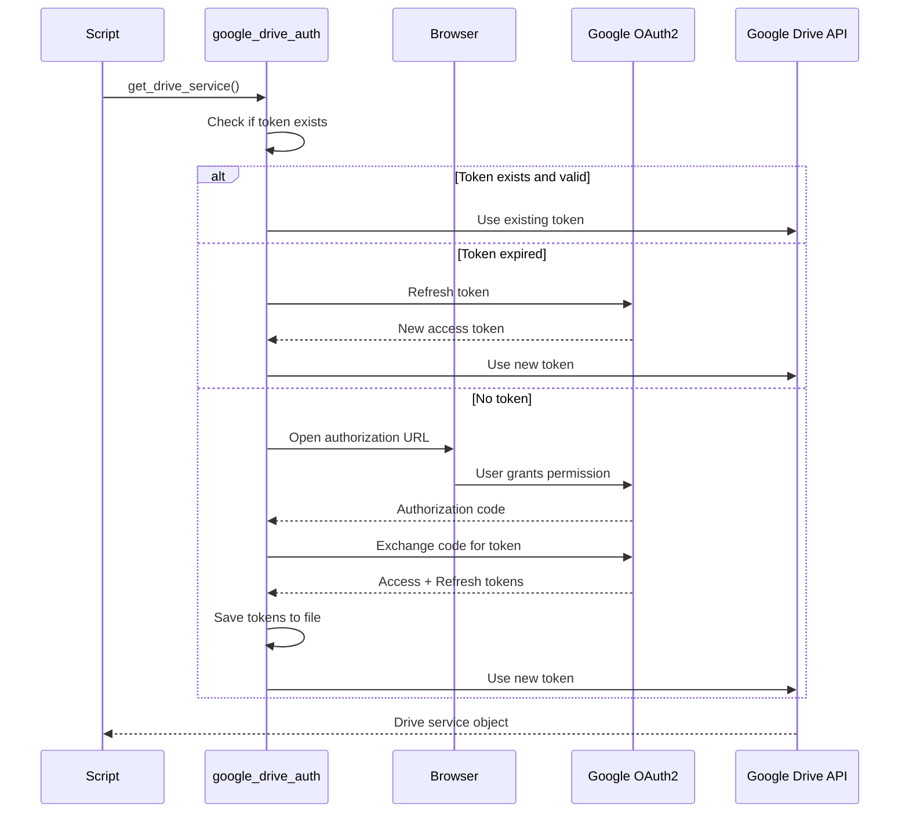
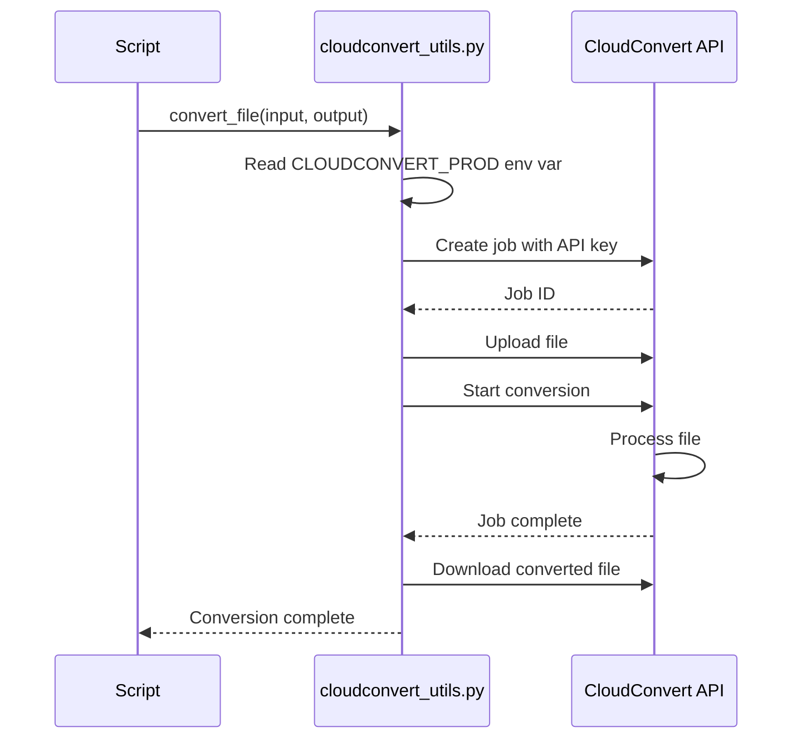
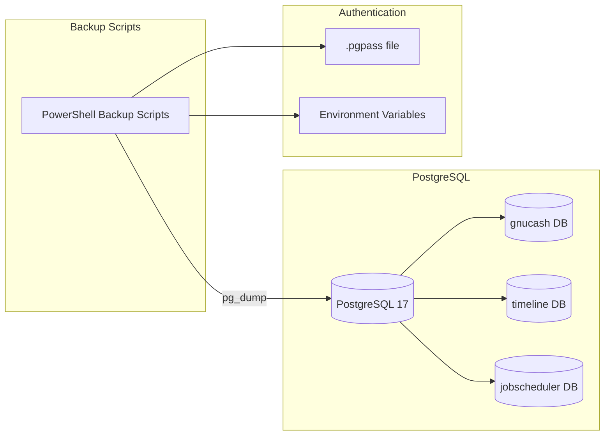

# External Service Integrations

## Overview

My-Scripts integrates with multiple external services and tools to provide automation capabilities. This document describes each integration, including authentication methods, API usage, configuration requirements, and scripts that depend on each service.

---

## Integration Summary

| Service | Type | Authentication | Scripts | Platform |
|---------|------|----------------|---------|----------|
| **Google Drive API** | Cloud Storage | OAuth2 | 3+ scripts | Cross-platform |
| **CloudConvert API** | File Conversion | API Key | 1 module | Cross-platform |
| **PostgreSQL** | Database | .pgpass / Env Vars | 3+ backup scripts | Cross-platform |
| **VLC Media Player** | Media Processing | N/A (CLI) | Videoscreenshot module | Cross-platform |
| **Windows Task Scheduler** | Automation | Windows Auth | Multiple tasks | Windows only |
| **Git** | Version Control | SSH/HTTPS | Git hooks | Cross-platform |

---

## 1. Google Drive API

### Overview

Google Drive API is used for backup storage, file recovery, file cleanup, and storage monitoring. Scripts authenticate via OAuth2 and interact with Google Drive using the official Python client library.

### Purpose
- **Backup Storage**: Upload database backups for off-site storage
- **File Recovery**: Recover deleted files from Google Drive
- **File Cleanup**: Delete files from Google Drive root folder
- **Storage Monitoring**: Monitor Google Drive space usage

### Authentication

**Method**: OAuth2 with refresh tokens

**Credentials Required**:
1. **Client Secret File**: `client_secret_*.json`
   - Obtained from Google Cloud Console
   - Contains OAuth2 client ID and secret
   - Location: Hardcoded path in `google_drive_auth.py`

2. **Token File**: `drive_token.json`
   - Generated during first OAuth2 authorization
   - Contains access token and refresh token
   - Location: `~/.credentials/drive_token.json`

**OAuth2 Flow**:


### API Scopes

**Required Scopes**:
- `https://www.googleapis.com/auth/drive` – Full Drive access (read, write, delete)

**Alternative Scopes** (recommended for least privilege):
- `https://www.googleapis.com/auth/drive.file` – Per-file access (files created by app only)
- `https://www.googleapis.com/auth/drive.metadata.readonly` – Read-only metadata (list files only)

**Current Implementation**: Uses full Drive scope

### Python Module

**Module**: `src/python/modules/auth/google_drive_auth.py`

**Key Functions**:
- `get_drive_service()`: Returns authenticated Google Drive service object
- `get_credentials()`: Manages OAuth2 token refresh
- `authorize()`: Handles initial OAuth2 authorization flow

**Dependencies**:
- `google-auth`
- `google-auth-oauthlib`
- `google-api-python-client`
- `elevation` (for admin privilege detection)

### Scripts Using Google Drive

| Script | Language | Purpose |
|--------|----------|---------|
| `gdrive_recover.py` | Python | Recover deleted files from Google Drive trash |
| `google_drive_root_files_delete.py` | Python | Delete files from Google Drive root folder |
| `drive_space_monitor.py` | Python | Monitor Google Drive storage usage and send alerts |
| `Backup-*.ps1` scripts | PowerShell | Upload database backups to Google Drive (via Python helper) |

### Configuration

**Environment Variables**: None required (uses token file)

**Credential File Locations**:
```
~/.credentials/
├── client_secret_*.json  # OAuth2 client credentials
└── drive_token.json      # Access and refresh tokens
```

**Setup Steps**:
1. Enable Google Drive API in Google Cloud Console
2. Create OAuth2 credentials (Desktop App)
3. Download `client_secret_*.json`
4. Place in expected location
5. Run script to trigger OAuth2 flow
6. Grant permissions in browser
7. Token saved automatically

### API Rate Limits

**Quotas** (as of 2024):
- **Queries per day**: 1,000,000,000
- **Queries per 100 seconds per user**: 1,000

**Error Handling**: Scripts should implement exponential backoff for rate limit errors (HTTP 429)

### Example Usage

```python
from google_drive_auth import get_drive_service

# Authenticate and get service
service = get_drive_service()

# List files
results = service.files().list(pageSize=10).execute()
items = results.get('files', [])

for item in items:
    print(f"{item['name']} ({item['id']})")
```

---

## 2. CloudConvert API

### Overview

CloudConvert is a cloud-based file conversion service used for converting files between various formats (images, documents, audio, video).

### Purpose
- **File Format Conversion**: Convert files between 200+ formats
- **Batch Processing**: Convert multiple files in parallel

### Authentication

**Method**: API Key

**Configuration**:
- **Environment Variable**: `CLOUDCONVERT_PROD`
- **Format**: API key string (e.g., `eyJ0eXAiOiJKV1QiLCJhbGciOiJSUzI1NiJ9...`)
- **Obtained from**: CloudConvert Dashboard (https://cloudconvert.com/dashboard/api/v2/keys)

**Authentication Flow**:


### Python Module

**Module**: `src/python/cloud/cloudconvert_utils.py`

**Key Functions**:
- `convert_file()`: Convert a single file
- `batch_convert()`: Convert multiple files

**Dependencies**:
- `cloudconvert` (official Python SDK)
- `requests`

**HTTP Timeouts (connect, read in seconds)**:
- `TIMEOUT_QUICK`: `(5, 15)` for status checks
- `TIMEOUT_STANDARD`: `(5, 30)` for job creation and API calls
- `TIMEOUT_UPLOAD`: `(10, 300)` for file uploads
- `TIMEOUT_DOWNLOAD`: `(10, 300)` for file downloads

### Scripts Using CloudConvert

| Script | Language | Purpose |
|--------|----------|---------|
| `cloudconvert_utils.py` | Python | Wrapper for CloudConvert API with error handling |
| Cloud processing scripts | Python | Batch file conversions |

### Configuration

**Environment Variables**:
```bash
export CLOUDCONVERT_PROD="your_api_key_here"
```

**Windows**:
```powershell
$env:CLOUDCONVERT_PROD = "your_api_key_here"
```

### API Rate Limits

**Free Tier** (as of 2024):
- **25 conversion minutes/month**
- **1 GB file size limit**
- **5 concurrent jobs**

**Paid Tier**:
- **Pay-as-you-go**: $0.008/conversion minute
- **Packages available**: 500 minutes for $4

**Error Handling**: Scripts should handle quota exceeded errors gracefully

### Example Usage

```python
import cloudconvert
import os

api_key = os.environ.get('CLOUDCONVERT_PROD')
cloudconvert.configure(api_key=api_key)

job = cloudconvert.Job.create(payload={
    'tasks': {
        'import-file': {
            'operation': 'import/url',
            'url': 'https://example.com/input.png'
        },
        'convert-file': {
            'operation': 'convert',
            'input': 'import-file',
            'output_format': 'jpg'
        },
        'export-file': {
            'operation': 'export/url',
            'input': 'convert-file'
        }
    }
})

# Wait for job completion
job = cloudconvert.Job.wait(id=job['id'])
```

---

## 3. PostgreSQL

### Overview

PostgreSQL is used as the database backend for multiple applications (GnuCash, Timeline, Job Scheduler). Scripts perform automated backups using `pg_dump`.

### Purpose
- **Database Backups**: Daily automated backups of PostgreSQL databases
- **Data Processing**: Load and query timeline data
- **Finance Tracking**: GnuCash database backend

### Authentication

**Methods**:
1. **`.pgpass` file** (recommended)
2. **Environment variables**
3. **Inline credentials** (not recommended)

#### Method 1: .pgpass File

**Location**:
- **Windows**: `%APPDATA%\postgresql\pgpass.conf`
- **Linux/macOS**: `~/.pgpass`

**Format**:
```
hostname:port:database:username:password
```

**Example**:
```
localhost:5432:timeline:backup_user:SecurePassword123
localhost:5432:gnucash:backup_user:SecurePassword456
localhost:5432:*:backup_user:SecurePassword789
```

**Permissions** (Linux/macOS):
```bash
chmod 600 ~/.pgpass
```

#### Method 2: Environment Variables

```bash
export PGHOST="localhost"
export PGPORT="5432"
export PGDATABASE="timeline"
export PGUSER="backup_user"
export PGPASSWORD="SecurePassword123"
```

### PostgreSQL Service

**Service Name**: `postgresql-x64-17`

**Installation Path**: `D:\Program Files\PostgreSQL\17\`

**Binaries**:
- `pg_dump.exe`: Database backup utility
- `psql.exe`: Interactive terminal

**Service Management**:
```powershell
# Start service
Start-Service postgresql-x64-17

# Stop service
Stop-Service postgresql-x64-17

# Check status
Get-Service postgresql-x64-17
```

### PowerShell Module

**Module**: `src/powershell/modules/PostgresBackup/PostgresBackup.psm1`

**Key Functions**:
- `Backup-Database()`: Execute pg_dump and manage retention
- `Start-PostgresService()`: Start PostgreSQL service if stopped
- `Stop-PostgresService()`: Stop PostgreSQL service
- `Remove-OldBackups()`: Delete backups older than retention period

**Dependencies**:
- PowerShellLoggingFramework (required)
- PostgreSQL 17+ client tools (pg_dump)

### Backup Scripts

| Script | Database | Purpose |
|--------|----------|---------|
| `Backup-GnuCashDatabase.ps1` | gnucash | Backup personal finance database |
| `Backup-TimelineDatabase.ps1` | timeline | Backup location/timeline database |
| `Backup-JobSchedulerDatabase.ps1` | jobscheduler | Backup job scheduler metadata |

### Backup Configuration

**Backup Parameters**:
- **Retention**: 30 days (configurable)
- **Schedule**: Daily at 2:00 AM (via Task Scheduler)
- **Format**: Plain SQL dump (`.sql`)
- **Location**: `D:\Backups\{database}/` (configurable)

**pg_dump Command**:
```powershell
pg_dump --dbname=timeline --username=backup_user --format=plain --file=timeline_2025-11-21.sql
```

### Database Users

**Timeline Database**:
- `timeline_writer`: INSERT, SELECT on timeline schema
- `backup`: SELECT on all tables (for backups)

**GnuCash Database**:
- Application user (full access)
- `backup`: SELECT on all tables

### Connection Diagram



---

## 4. VLC Media Player

### Overview

VLC Media Player is a cross-platform media player used for video frame capture and screenshot generation.

### Purpose
- **Video Screenshots**: Extract frames from videos at specific timestamps
- **Media Processing**: Process video files via command-line

### Integration Method

**Type**: Command-line invocation

**Requirements**:
- VLC installed and added to `PATH`
- Command: `vlc` available in terminal

### PowerShell Module

**Module**: `src/powershell/modules/Videoscreenshot/Videoscreenshot.psm1`

**Key Functions**:
- `Get-VideoScreenshot()`: Capture video frame using VLC
- `Get-VideoScreenshotGDI()`: Alternative method using GDI+ (Windows only)

**VLC Command Example**:
```powershell
vlc "video.mp4" --rate=1 --video-filter=scene --start-time=60 --stop-time=61 --scene-format=png --scene-path="output/" --scene-prefix="screenshot_" vlc://quit
```

### Configuration

**Environment**: VLC must be on `PATH`

**Installation**:
- **Windows**: Install VLC and add to PATH: `C:\Program Files\VideoLAN\VLC\`
- **Linux**: `sudo apt install vlc`
- **macOS**: `brew install vlc`

**Verification**:
```bash
vlc --version
```

### Alternative Methods

**GDI+ (Windows Only)**:
- Uses Windows GDI+ library for frame capture
- No external dependencies required
- Windows-specific implementation

**Python Cropping**:
- Optional post-processing via `crop_colours.py`
- Crops screenshots to remove black bars

### Example Usage

```powershell
Import-Module Videoscreenshot

# Capture screenshot at 60 seconds
Get-VideoScreenshot -VideoPath "movie.mp4" -Timestamp 60 -OutputPath "screenshot.png"
```

---

## 5. Windows Task Scheduler

### Overview

Windows Task Scheduler is used to automate daily execution of backup scripts and system maintenance tasks.

### Purpose
- **Automated Backups**: Run database backup scripts daily
- **System Maintenance**: Execute log cleanup, health checks
- **Scheduled Tasks**: Run scripts at specific times

### Integration Method

**Type**: Windows service (built-in)

**Authentication**: Windows user credentials

**Configuration Location**: `config/tasks/`

### Task Configuration

**Task Definition Format**: XML (exported from Task Scheduler)

**Common Settings**:
- **Trigger**: Daily at 2:00 AM
- **Action**: Run PowerShell script
- **Conditions**: Only if AC power available
- **Settings**: Run with highest privileges

**Example Task XML**:
```xml
<Task>
  <Triggers>
    <CalendarTrigger>
      <StartBoundary>2025-01-01T02:00:00</StartBoundary>
      <ScheduleByDay>
        <DaysInterval>1</DaysInterval>
      </ScheduleByDay>
    </CalendarTrigger>
  </Triggers>
  <Actions>
    <Exec>
      <Command>powershell.exe</Command>
      <Arguments>-File "C:\Scripts\Backup-GnuCashDatabase.ps1"</Arguments>
    </Exec>
  </Actions>
</Task>
```

### Scheduled Tasks

| Task Name | Script | Schedule | Purpose |
|-----------|--------|----------|---------|
| Backup GnuCash DB | `Backup-GnuCashDatabase.ps1` | Daily 2:00 AM | Backup personal finance database |
| Backup Timeline DB | `Backup-TimelineDatabase.ps1` | Daily 2:15 AM | Backup location database |
| Backup Job Scheduler DB | `Backup-JobSchedulerDatabase.ps1` | Daily 2:30 AM | Backup job metadata |
| System Health Check | `Test-SystemHealth.ps1` | Daily 6:00 AM | Check system health |
| Purge Old Logs | `Invoke-PurgeLogs.ps1` | Weekly Sunday 3:00 AM | Clean up old log files |

### Task Management

**PowerShell Commands**:
```powershell
# List tasks
Get-ScheduledTask

# Run task manually
Start-ScheduledTask -TaskName "Backup GnuCash DB"

# Get task status
Get-ScheduledTask -TaskName "Backup GnuCash DB" | Get-ScheduledTaskInfo
```

**Task Scheduler UI**: `taskschd.msc`

---

## 6. Git

### Overview

Git is used for version control with custom hooks for enforcing coding standards and automating module deployment.

### Purpose
- **Version Control**: Track changes to scripts and modules
- **Automation**: Trigger actions on commits (linting, testing, deployment)
- **Standards Enforcement**: Ensure conventional commits, code quality

### Git Hooks

**Location**: `hooks/` (repository root)

**Active Hooks**:

| Hook | Purpose | Language |
|------|---------|----------|
| `pre-commit` | Run linters (PSScriptAnalyzer, pylint) | Bash |
| `commit-msg` | Enforce conventional commit format | Bash |
| `post-commit` | Log commit details | Bash |
| `post-merge` | Deploy updated modules | PowerShell |

**Conventional Commit Format**:
```
<type>(<scope>): <description>

[optional body]

[optional footer]
```

**Types**: `feat`, `fix`, `docs`, `style`, `refactor`, `test`, `chore`

**Example**:
```
feat(backup): add Google Drive upload to PostgreSQL backups

- Integrate google_drive_auth module
- Upload backups after successful pg_dump
- Add retry logic for network failures

Closes #123
```

### Git Configuration

**Required**:
```bash
git config user.name "Your Name"
git config user.email "your.email@example.com"
```

**Recommended**:
```bash
git config core.hooksPath hooks
git config commit.gpgsign true
```

---

## Security Considerations

### Credential Management

**Do NOT commit**:
- API keys
- Passwords
- OAuth2 client secrets
- OAuth2 tokens
- `.pgpass` files

**Use**:
- Environment variables for API keys
- `.gitignore` for credential files
- Secure storage (e.g., `~/.credentials/`) outside repository

**Example `.gitignore`**:
```
client_secret*.json
*token.json
.pgpass
pgpass.conf
.env
*.key
```

### API Key Rotation

**Best Practices**:
1. Rotate API keys every 90 days
2. Use least privilege scopes (Google Drive)
3. Monitor API usage for anomalies
4. Revoke unused keys

### Network Security

**Considerations**:
- Use HTTPS for all API calls (Google Drive, CloudConvert)
- PostgreSQL: Use SSL connections for remote databases
- VLC: Local execution only (no network access)

---

## Troubleshooting

### Google Drive Authentication Issues

**Problem**: Token expired or invalid

**Solution**:
1. Delete `drive_token.json`
2. Run script again to trigger OAuth2 flow
3. Grant permissions in browser

**Problem**: `client_secret_*.json` not found

**Solution**:
1. Check file path in `google_drive_auth.py`
2. Ensure file exists at expected location
3. Verify file permissions

### PostgreSQL Connection Issues

**Problem**: `pg_dump: error: connection to database "timeline" failed`

**Solution**:
1. Check PostgreSQL service is running: `Get-Service postgresql-x64-17`
2. Verify `.pgpass` file exists and has correct format
3. Test connection: `psql -U backup_user -d timeline`

### VLC Command-Line Issues

**Problem**: `vlc: command not found`

**Solution**:
1. Verify VLC is installed
2. Add VLC to `PATH`
3. Test: `vlc --version`

### CloudConvert API Issues

**Problem**: `CloudConvert API: Unauthorized`

**Solution**:
1. Check `CLOUDCONVERT_PROD` environment variable is set
2. Verify API key is valid
3. Check account quota not exceeded

---

## Related Documentation

- **[Database Schemas](database-schemas.md)** – PostgreSQL database details
- **[Module Dependencies](module-dependencies.md)** – Module integration details
- **[Data Flows](data-flows.md)** – How services integrate in workflows

---

## Maintenance

**Regular Tasks**:
- Rotate API keys (Google Drive, CloudConvert) every 90 days
- Monitor API quota usage
- Update client libraries (Python packages, PowerShell modules)
- Review OAuth2 scopes for least privilege
- Test backup restore procedures quarterly
