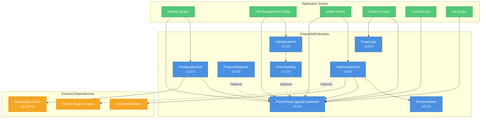
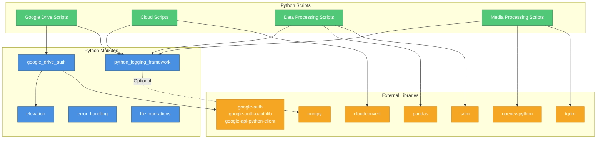

# Module Dependencies

## Overview

This document maps the dependencies between modules, scripts, and external libraries in the My-Scripts repository. Understanding these dependencies is crucial for:
- **Impact Analysis**: Knowing which scripts are affected by module changes
- **Refactoring**: Identifying coupling and potential refactoring opportunities
- **Testing**: Determining test scope when changes are made
- **Onboarding**: Understanding the module architecture

---

## PowerShell Module Dependency Graph

### Complete Dependency Graph



**Legend**:
- **Solid Lines** (→): Required dependency
- **Dashed Lines** (⇢): Optional dependency
- **Blue Boxes**: PowerShell modules
- **Green Boxes**: Application scripts
- **Orange Boxes**: External tools

---

## PowerShell Module Details

### Core Infrastructure Modules

#### 1. PowerShellLoggingFramework (v2.0.0)

**Purpose**: Cross-platform structured logging with JSON support and multiple log levels.

**Dependencies**: None

**Dependents**:
- ErrorHandling (optional)
- ProgressReporter (optional)
- PostgresBackup
- Videoscreenshot
- All backup scripts
- All system scripts
- Most application scripts

**Key Features**:
- Structured logging (plain-text and JSON)
- Multiple log levels (DEBUG, INFO, WARNING, ERROR, CRITICAL)
- Cross-platform (Windows, Linux, macOS)
- IST timezone support

**Location**: `src/powershell/modules/PowerShellLoggingFramework/`

**Deployment Target**: System (Program Files) or User (Documents)

---

#### 2. ErrorHandling (v1.0.0)

**Purpose**: Standardized error handling with retry logic and exponential backoff.

**Dependencies**:
- PowerShellLoggingFramework (optional, for logging retry attempts)

**Dependents**:
- FileOperations (required)
- Application scripts using retry logic

**Key Features**:
- `Invoke-WithRetry`: Execute scriptblocks with automatic retry
- Exponential backoff (1s, 2s, 4s, 8s, ...)
- Configurable retry count and delay
- Optional logging integration

**Location**: `src/powershell/modules/ErrorHandling/`

**Example Usage**:
```powershell
Invoke-WithRetry -ScriptBlock { Copy-Item $src $dest } -MaxRetries 3
```

---

#### 3. FileOperations (v1.0.0)

**Purpose**: File operations (copy, move, remove, rename) with automatic retry logic.

**Dependencies**:
- ErrorHandling (required)

**Dependents**:
- File management scripts
- Backup scripts (for file cleanup)

**Key Functions**:
- `Copy-FileWithRetry`: Copy files with automatic retry on transient failures
- `Move-FileWithRetry`: Move files with automatic retry
- `Remove-FileWithRetry`: Delete files with automatic retry
- `Rename-FileWithRetry`: Rename files with automatic retry

**Default Behavior**: 3 retries with exponential backoff (1s, 2s, 4s)

**Location**: `src/powershell/modules/FileOperations/`

---

#### 4. ProgressReporter (v1.0.0)

**Purpose**: Standardized progress reporting with logging integration.

**Dependencies**:
- PowerShellLoggingFramework (optional, for logging progress)

**Dependents**:
- Long-running scripts (file distribution, backups)

**Key Features**:
- Unified progress reporting interface
- Integration with PowerShell Write-Progress
- Optional logging of progress milestones

**Location**: `src/powershell/modules/ProgressReporter/`

---

### Domain-Specific Modules

#### 5. PostgresBackup (v2.0.0)

**Purpose**: PostgreSQL database backup using pg_dump with retention management.

**Dependencies**:
- PowerShellLoggingFramework (required)
- PostgreSQL 17+ client tools (pg_dump)

**Dependents**:
- `Backup-GnuCashDatabase.ps1`
- `Backup-TimelineDatabase.ps1`
- `Backup-JobSchedulerDatabase.ps1`

**Key Features**:
- Automated pg_dump execution
- Service management (start/stop PostgreSQL service)
- Retention policy enforcement (default: 30 days)
- Google Drive upload integration (optional)
- `.pgpass` authentication support

**External Requirements**:
- PostgreSQL 17+ installed at `D:\Program Files\PostgreSQL\17\`
- `.pgpass` file configured for authentication

**Location**: `src/powershell/modules/PostgresBackup/`

---

#### 6. Videoscreenshot (v3.0.2)

**Purpose**: Video frame capture via VLC or GDI+ with optional Python cropping.

**Dependencies**:
- RandomName (required, for generating output filenames)
- PowerShellLoggingFramework (required)
- VLC Media Player (optional, for VLC capture method)
- Python image cropper (optional, for cropping)

**Dependents**:
- Media processing scripts
- Video screenshot automation

**Key Features**:
- Multiple capture methods (VLC, GDI+)
- Random filename generation for output
- Optional image cropping via Python
- Configurable output format (PNG, JPG)

**External Requirements**:
- **VLC**: Installed and on PATH (for VLC method)
- **Python**: `crop_colours.py` available (for cropping)

**Location**: `src/powershell/modules/Videoscreenshot/`

---

#### 7. RandomName (v2.1.0)

**Purpose**: Generates Windows-safe random filenames using conservative allow-list.

**Dependencies**: None

**Dependents**:
- Videoscreenshot (required)
- File distribution scripts

**Key Features**:
- Cryptographically secure random names
- Windows-safe characters only (alphanumeric + underscore)
- Configurable length (default: 16 characters)
- Collision detection (optional)

**Location**: `src/powershell/modules/RandomName/`

**Example Output**: `a3f9b2e1c4d5f6a7`

---

#### 8. PurgeLogs (v2.0.0)

**Purpose**: Log file retention management with configurable policies.

**Dependencies**: None

**Dependents**:
- System maintenance scripts
- Automated log cleanup tasks

**Key Features**:
- Configurable retention period (default: 30 days)
- Recursive log file discovery
- Cross-platform (Windows, Linux, macOS)
- Dry-run mode for testing

**Location**: `src/powershell/modules/PurgeLogs/`

**Example Usage**:
```powershell
Remove-OldLogs -LogDirectory "C:\Logs" -RetentionDays 30
```

---

## Python Module Dependency Graph

### Complete Dependency Graph



---

## Python Module Details

### 1. python_logging_framework

**Purpose**: Cross-platform structured logging (plain-text/JSON) with IST timestamps.

**Location**: `src/python/modules/logging/`

**Dependencies**:
- Standard library: `logging`, `socket`, `zoneinfo`

**Dependents**:
- All Python scripts (required for logging)

**Key Features**:
- Plain-text and JSON log formats
- IST timezone support
- Hostname and PID in every log entry
- Cross-platform (Windows, Linux, macOS)

**Example Usage**:
```python
from python_logging_framework import setup_logging
logger = setup_logging("my_script")
logger.info("Processing complete")
```

---

### 2. google_drive_auth

**Purpose**: Google Drive API authentication with OAuth2 flow and token management.

**Location**: `src/python/modules/auth/`

**Dependencies**:
- `google-auth`
- `google-auth-oauthlib`
- `google-api-python-client`
- `elevation` (for admin privilege detection)

**Dependents**:
- `gdrive_recover.py`
- `google_drive_root_files_delete.py`
- `drive_space_monitor.py`

**Key Features**:
- OAuth2 authentication flow
- Token caching and refresh
- Service object creation
- Credential file management

**Credential Files**:
- **Client Secret**: `client_secret_*.json` (hardcoded path)
- **Token**: `drive_token.json` (stored in `~/.credentials/`)

**Example Usage**:
```python
from google_drive_auth import get_drive_service
service = get_drive_service()
```

---

### 3. elevation

**Purpose**: Windows admin privilege detection.

**Location**: `src/python/modules/auth/`

**Dependencies**: None (Windows API calls)

**Dependents**:
- `google_drive_auth` (for privilege checks)

**Key Features**:
- Detects if script is running with administrator privileges
- Windows-specific implementation

**Example Usage**:
```python
from elevation import is_admin
if is_admin():
    print("Running as administrator")
```

---

### 4. error_handling

**Purpose**: Error handling utilities.

**Location**: `src/python/modules/utils/`

**Dependencies**: None

**Dependents**: Various scripts

**Key Features**:
- Retry logic
- Error categorization
- Exception handling utilities

---

### 5. file_operations

**Purpose**: File operation utilities.

**Location**: `src/python/modules/utils/`

**Dependencies**: None

**Dependents**: Various scripts

**Key Features**:
- Safe file operations
- Path normalization
- File validation

---

## External Dependencies

### Python Packages (requirements.txt)

| Package | Version | Purpose | Used By |
|---------|---------|---------|---------|
| **requests** | Latest | HTTP requests | Cloud scripts |
| **numpy** | Latest | Numerical computing | Data processing, media |
| **pandas** | Latest | Data manipulation | Data processing |
| **opencv-python** | Latest | Image processing | Media scripts |
| **cloudconvert** | Latest | CloudConvert API | `cloudconvert_utils.py` |
| **google-auth** | Latest | Google OAuth2 | `google_drive_auth` |
| **google-auth-oauthlib** | Latest | OAuth2 flow | `google_drive_auth` |
| **google-api-python-client** | Latest | Google API | `google_drive_auth` |
| **oauth2client** | Latest | OAuth2 (legacy) | Google Drive scripts |
| **tqdm** | Latest | Progress bars | `find_duplicate_images.py` |
| **srtm** | Latest | Elevation data | `csv_to_gpx.py` (Python <3.11) |
| **networkx** | Latest | Graph algorithms | Data processing |
| **openpyxl** | Latest | Excel files | Data processing |
| **psycopg2** | Latest | PostgreSQL adapter | Database scripts |
| **pytz** | Latest | Timezone handling | Timestamp processing |
| **pytest** | Latest | Testing framework | Unit tests |
| **pytest-cov** | Latest | Coverage reports | Unit tests |
| **pytest-mock** | Latest | Mocking | Unit tests |

---

## Cross-Language Dependencies

### Unified Logging Specification

Both PowerShell and Python modules follow the same logging specification:

**Format**:
```
[YYYY-MM-DD HH:mm:ss.fff TIMEZONE] [LEVEL] [ScriptName] [HostName] [PID] Message
```

**Implementation**:
- **PowerShell**: `PowerShellLoggingFramework` module
- **Python**: `python_logging_framework` module

**Benefits**:
- Consistent log parsing across languages
- Unified log aggregation
- Centralized log cleanup (PurgeLogs module)

**Specification**: `docs/specifications/logging_specification.md`

---

## Module Deployment

### PowerShell Module Deployment

**Deployment Script**: `scripts/deploy_modules.ps1`

**Configuration File**: `config/modules/deployment.txt`

**Deployment Targets**:
- **System**: `C:\Program Files\PowerShell\Modules\` (requires admin)
- **User**: `~\Documents\PowerShell\Modules\` (user-level)
- **Alt**: Custom path specified in configuration

**Deployment Process**:
1. Read configuration from `deployment.txt`
2. For each module:
   - Validate module structure
   - Copy to target location(s)
   - Update module manifest
3. Verify deployment success

**Example Configuration**:
```
ModuleName | RelativePath | Targets | Author | Description
PowerShellLoggingFramework | src/powershell/modules/PowerShellLoggingFramework | System,User | Manoj | Logging framework
```

---

### Python Module Deployment

**Installation**: Modules are imported directly from `src/python/modules/` via `PYTHONPATH` or relative imports.

**No Deployment Required**: Python scripts reference modules using relative imports or sys.path manipulation.

**Example**:
```python
import sys
sys.path.append('src/python/modules')
from python_logging_framework import setup_logging
```

---

## Dependency Analysis

### Module Coupling

**Loosely Coupled**:
- RandomName (no dependencies)
- PurgeLogs (no dependencies)
- python_logging_framework (stdlib only)

**Moderately Coupled**:
- ErrorHandling → PowerShellLoggingFramework (optional)
- FileOperations → ErrorHandling
- ProgressReporter → PowerShellLoggingFramework (optional)

**Tightly Coupled**:
- PostgresBackup → PowerShellLoggingFramework + PostgreSQL client
- Videoscreenshot → RandomName + PowerShellLoggingFramework + VLC
- google_drive_auth → Multiple Google libraries + elevation

### Refactoring Opportunities

1. **Optional Logging**: ErrorHandling and ProgressReporter have optional logging dependencies, making them more flexible

2. **Standalone Utilities**: RandomName, PurgeLogs, and python_logging_framework are standalone and easily reusable

3. **External Tool Abstraction**: Videoscreenshot abstracts VLC and GDI+ behind a common interface

4. **Retry Logic**: ErrorHandling provides reusable retry logic used by FileOperations

### Impact Analysis

**Changing PowerShellLoggingFramework**:
- **High Impact**: Affects most PowerShell modules and scripts
- **Mitigation**: Comprehensive unit tests, backward compatibility

**Changing ErrorHandling**:
- **Medium Impact**: Affects FileOperations and scripts using retry logic
- **Mitigation**: Test FileOperations thoroughly

**Changing RandomName**:
- **Low Impact**: Only affects Videoscreenshot
- **Mitigation**: Test Videoscreenshot after changes

---

## Related Documentation

- **[External Integrations](external-integrations.md)** – External service and tool dependencies
- **[Data Flows](data-flows.md)** – How modules interact in workflows
- **[ARCHITECTURE.md](../../ARCHITECTURE.md)** – High-level architecture overview

---

## Visualization Tools

This document uses **Mermaid** diagrams for dependency visualization. To view diagrams:
- **GitHub**: Mermaid renders automatically in Markdown
- **Local**: Use VS Code with Mermaid extension or online editor (https://mermaid.live/)

---

## Maintenance Notes

**Keeping This Document Updated**:
1. Add new modules to dependency graphs when created
2. Update version numbers when modules are released
3. Document new external dependencies in requirements.txt
4. Review coupling when refactoring modules
